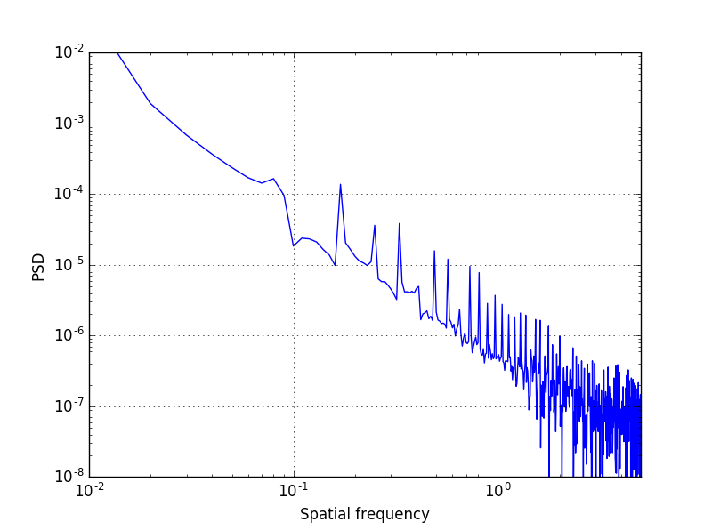

# RoadProfile
A python module generates road surface profile based on ISO 8608

## About the algorithm

This is a Python implementation of road profile generation method described in 

        Da Silva, J. G. S. "Dynamical performance of highway bridge
        decks with irregular pavement surface."
        Computers & structures 82.11 (2004): 871-881.

## Examples:

    # Create a RoadProfile instance
    testprofile = RoadProfile()
    # Get a road profile
    print testprofile.generate(1, 0.1)
    # Set profile instance to E
    testprofile.set_profile_class("E")
    # Regenerate the road profile with new class
    print testprofile.generate(1, 0.1)
    # Set profile to A and regenerate a road profile
    testprofile.get_profile_by_class("A", 1, 0.1)

### Generate a class A profile:
    
[The `example1.py` file](./example/example1.py) in example folder generates a class A profile. The PSD matches with ISO 8608:

This code is released under GPLv3, please check LICENSE file for details.
