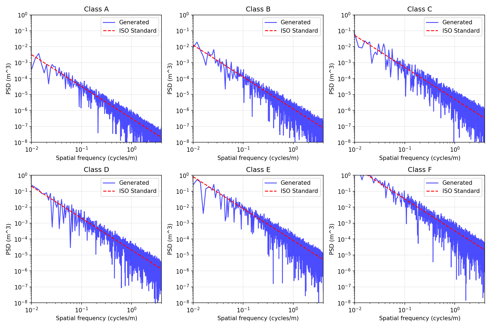
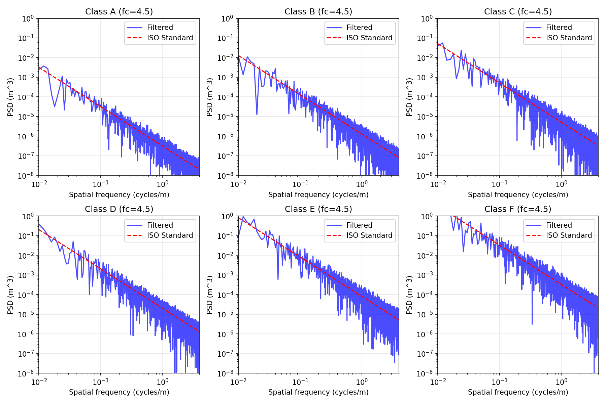
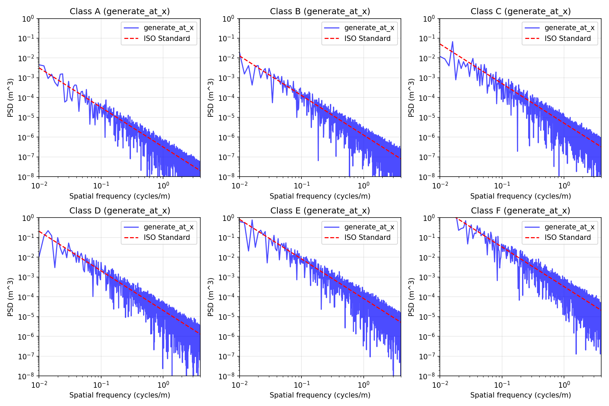
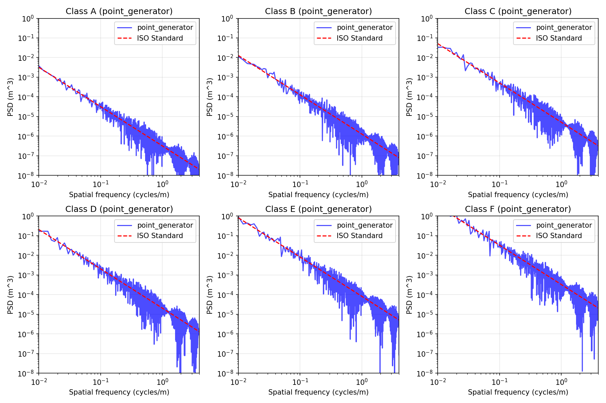

# RoadProfile

A Python module for generating road surface profiles based on ISO 8608, with support for time-domain filtering and dynamic class changes.

## Installation

You can install `roadprofile` directly from PyPI:

```bash
pip install roadprofile
```


## Classes

### RoadProfile
Basic road profile generation using frequency domain method (ISO 8608).

### FilteredRoadProfile  
Road profile with time-domain Butterworth lowpass filtering. Supports dynamic parameters.

### DynamicRoadProfile
Dynamic road profile generator that supports:
- Batch generation with varying classes
- Real-time generator with dynamic class/dx changes

## Examples

### Basic Usage

```python
from roadprofile import RoadProfile

rp = RoadProfile()
rp.set_profile_class("A")
profile = rp.generate(L=100, dx=0.1)
print(profile.x, profile.profile)

# Using get_profile_by_class
profile = rp.get_profile_by_class("B", L=100, dx=0.1)
```

### FilteredRoadProfile

```python
from roadprofile import FilteredRoadProfile

frp = FilteredRoadProfile(fc=4.5, order=4)
frp.set_profile_class("A")
profile = frp.generate(L=100, dx=0.1)

# With ISO class (auto-sets filter params)
frp.set_profile_class("C")
profile = frp.generate(L=100, dx=0.1)
```

### DynamicRoadProfile - Batch Generation

```python
from roadprofile import DynamicRoadProfile

drp = DynamicRoadProfile()

# Generate with varying classes
classes = ["A"] * 50 + ["B"] * 50 + ["C"] * 50
profile = drp.generate(L=15, dx=0.1, profile_classes=classes)
```

### DynamicRoadProfile - Real-time Generator

```python
from roadprofile import DynamicRoadProfile

drp = DynamicRoadProfile()
drp.set_profile_class("A")  # Set class before creating generator
gen = drp.create_generator(dx=0.1)

# Get next point
p1 = next(gen)

# Change class
gen.send('B')
p2 = next(gen)

# Change sampling interval
gen.send(0.05)
p3 = next(gen)
```

### Irregular Spacing

All classes support irregular spacing via `generate_at_x(x)`:

```python
import numpy as np
from roadprofile import RoadProfile

rp = RoadProfile()
rp.set_profile_class("A")

x_irregular = np.array([0, 0.05, 0.15, 0.3, 0.5, 0.8, 1.2, 1.5, 2.0])
profile = rp.generate_at_x(x_irregular)
```

## Testing

Run regression tests with PSD validation:

```bash
cd example
python test_regression.py
```

This generates validation plots:
- `test_psd_validation.png` - RoadProfile PSD validation
- `test_filtered_psd_validation.png` - FilteredRoadProfile PSD validation  
- `test_generate_at_x_psd.png` - generate_at_x PSD validation
- `test_point_generator_psd.png` - point_generator PSD validation

## PSD Validation Results

### RoadProfile (Frequency Domain)


### FilteredRoadProfile (Time Domain Filter)


### generate_at_x (Irregular Spacing)


### point_generator (Real-time)


## ISO Classes

| Class | Gdn0 (m³) |
|-------|-----------|
| A     | 32E-6     |
| B     | 128E-6    |
| C     | 512E-6    |
| D     | 2048E-6   |
| E     | 8192E-6   |
| F     | 32768E-6  |

## Algorithm

Based on the method described in:

Da Silva, J. G. S. "Dynamical performance of highway bridge decks with irregular pavement surface." Computers & structures 82.11 (2004): 871-881.

## License

GPLv3 - see LICENSE file for details.
